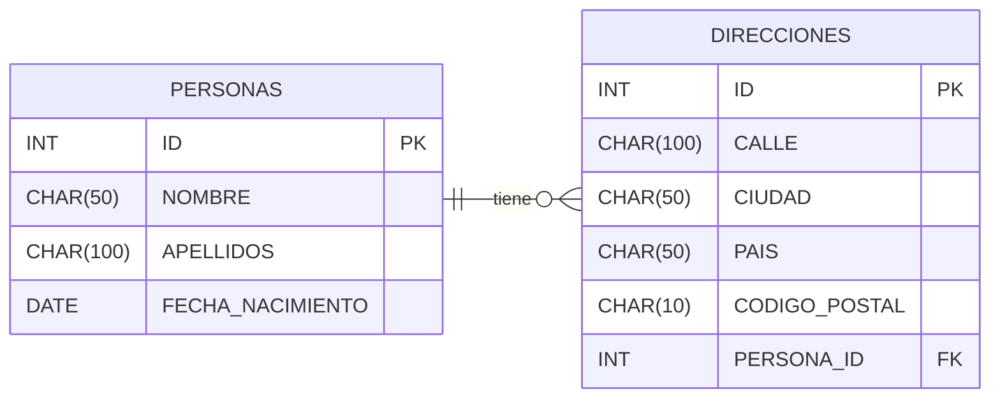

# BBDD 

- Información estructurada
- Información no redundante
- Integridad de datos
- Consultar datos / Actualición de datos
- Conjuntos de datos
- Seguridad
- Backups
- Claves Primarias, secundarias y foráneas

# BBDD Relacionales

- Las entidades se persisten/organizan en tablas 
- Relaciones entre tablas

Las BBDD Relacionales son programas expertos en trabajar con ficheros de acceso aleatorio que almacenan datos en formato tabular.
Cuando creo un programa, del tipo que sea... y tengo que guardar datos, dependiendo de la naturaleza de esos datos,elegiré una forma u otra de almacenarlos.
En ocasiones guardo/leo datos que gestionaré con ficheros de acceso secuencial (logs, configuración, etc).
En otras ocasiones, necesito ficheros de acceso aleatorio... y en estos casos no me planteo implementar yo mismo el acceso aleatorio a ficheros... Uso una BBDD Relacional.

---

# TABLAS

Los datos al final, dónde los guardamos?
Se guardan en un soporte físico (disco duro, SSD, etc), en ficheros.
Los datos tiene una estructura tabular (columnas y filas).

    | ID (PK) | NOMBRE | APELLIDOS | EDAD |
    |---------|--------|-----------|------|
    |    1    |  Juan  |   Pérez   |  30  |
    |    2    |  Ana   |   López   |  25  |
    |    3    |  Luis  |   García  |  28  |

 Esa tabla lleva asociado un schema (que me indica qué datos se van a guardar en cada columna, tipo de dato, tamaño, restricciones, etc).

    ID: INT, PK, NOT NULL
    NOMBRE: CHAR(50), NOT NULL
    APELLIDOS: CHAR(100), NOT NULL
    EDAD: INT, NULLABLE

    ¿Cúantos bytes ocupa cada campo? Suponiendo que tenemos UTF-8 como juego de caracteres, y que no estamos guardando cosas "raras"
    ID: INT: 4 bytes - Podríamos llegar a guardar valores entre -2.147.483.648 y 2.147.483.647
    NOMBRE: CHAR(50): 50 caracteres? 50 bytes
    APELLIDOS: CHAR(100): 100 caracteres? 100 bytes
    EDAD: INT: 4 bytes - Podríamos llegar a guardar valores entre -2.147.483.648 y 2.147.483.647

    Total por fila: 4 + 50 + 100 + 4 = 158 bytes por fila
    Si me piden leer/tocar la fila 3... y de ella el campo nombre, en qué posición debería de colocar la aguja del HDD?

    Fila1: 158 bytes
    Fila2: 158 bytes
    Fila3: ID+NOMBRE+APELLIDOS = 4 + 50 + 100 = 154 bytes

    TOTAL = 158 + 158 + 154 = 470 bytes
    Pon la aguja del disco en el byte 470 y lee 4 bytes ---> Tengo la edad de la fila 3
    o... pon la aguja del disco en el byte 4709 y escribe "29" (la nueva edad) (sobreescribo la edad de la fila 3)

    La naturaleza tabular de las tablas me permite calcular la posición física en disco de cualquier campo de cualquier fila de forma sencilla.

## Páginas de datos

Las BBDD no trabajan a ese nivel. Trabajan a nivel de páginas de datos.
Una página de datos es un conjunto de filas (registros) que se almacenan juntas en una parte del fichero de datos de la BBDD.
Tamaño típico de una página de datos: 8KB (8192 bytes)
Da igual si solo actualizo una edad, se lee o escribe una página completa (8KB).
Y las páginas por dentro tienen una determina estructura (header, filas, espacio libre, etc).
En el header va información como:
- Qué registros hay en la página (UUIDs)
- Cuánto ocupa cada registro (cada fila)
- Espacio libre disponible en la página
- etc
---

# Cuánto ocupa un caracter en disco?

Depende, del juego de caracteres(codificación) que usemos:
- ASCII
- ISO-8859-1 (Latin-1)
- UTF-8
- UTF-16
- UTF-32

## Juego de caracteres???
                    INVENTADO(propio)
    0000 0000  ---      a
    0010 0001  ---      j
    0010 0010  ---      m
    1010 0011  ---      p
    1111 1111  ---      /

    En un byte, cuántos caracteres puedo representar? 256 caracteres (2^8 = 256)

Y cuántos caracteres usa la humanidad? Muchos más de 256
En un byte puedo guardar 1 caracter? Depende de los caracteres que quiera usar.
Entonces hay definidos de forma estandar una serie de juegos de caracteres (codificaciones) que me permiten representar los caracteres que sean. Yo elegiré un juego de caracteres u otro en función de los caracteres que necesite representar.

- Si soy Americano/Inglés... Mis carateres habituales son pocos... y con 256 caracteres me vale (ASCII)
- Si soy español/de habla hispana... Necesito más caracteres (acentos, ñ, ç, etc)... Uso ISO-8859-1 (Latin-1) - 1 byte
  Esos caracteres se añaden a expensas de otros caracteres en ascii 

## ¿Cuántos caracteres usa la humanidad?

Están tabulados. Hay un estandar que recoje TODOS los caracteres que usa la humanidad (Unicode). En torno a 150.000.
Evidentemente eso no entra en 1 byte (256 caracteres).
Cuántos bytes necesito?
1 byte -> 256 caracteres
2 bytes -> 65.536 caracteres
4 bytes -> 4.294.967.296 caracteres

Unice define 3 formatos de codificación para representar los caracteres Unicode:
- UTF-8: Usa entre 1 y 4 bytes por caracter
  Los caracteres de uso más habitual usan 1 byte (los primeros 256 caracteres coinciden con ASCII)
  Para caracteres más raros (español, francés, belga...) usa 2 bytes
  Para caracteres mucho menos habituales (chino, japonés, emojis, etc) usa 4 bytes
- UTF-16: Usa entre 2 y 4 bytes por caracter
  Los caracteres de uso más habitual usan 2 bytes
  Para caracteres menos habituales usa 4 bytes
- UTF-32: Usa siempre 4 bytes por caracter
---

# Ficheros y Sistemas Operativos

¿De cuántas formas (modos de acceso) podemos acceder a un fichero en los Sistemas operativos que manejamos habitualmente?

¿Qué mecanismos me ofrecen los SO para acceder a los ficheros?
- Acceso secuencial: (JSON, CSV, XLSX, XML, TXT, IMAGEN, .ini, properties)
  - LECTURA: Leemos todo el fichero desde el principio hasta el final
  - ESCRITURA: (Re)Escribimos todo el fichero desde el principio hasta el final
               Añadir al final del fichero nuevos bytes (logs)
    Ventajas:
    - Sencillo de implementar
    Inconvenientes:
    - Rendimiento: si el fichero es grande y sólo queremos leeer/modificar una parte... Me toca leer/escribir todo el fichero
- Acceso aleatorio
 - Puedo pedirle al SO que se ponga en una posición concreta del fichero (byte) y lea/escriba a partir de ahí no se cuantos bytes.
   Ventajas:
   - Rendimiento: Si el fichero es grande y sólo quiero leer/modificar una parte, me pongo en la posición concreta y leo/escribo sólo lo que necesito
   Inconvenientes:
   - Más complejo de implementar (bastante!)

- Un SO me permite que varios procesos accedan simultáneamente a un fichero? 
  - Para lectura si...
  - Para escritura malamente
---
# Tablas y datos.

Cuando vamos guardando datos en una tabla, esos datos se van almacenando en páginas de datos... que se vuelcan a un fichero en disco.
Según llegan datos nuevos, se van almacenando en nuevas páginas de datos.... que se van añadiendo al final del fichero de datos (o del segmento de datos).

    Fichero de datos  |XXXXXXXXXXXXXXXXXXX..................XXXXX................................XXXXX...........|
                      |  Página1  |  Página2  |  Página3  |  Página4  |  Página5  |  Página6  |   ...            |
                      |. Tabla 1                          |. Tabla 2                          |   Indice 1       |

    En un momento dato, la página 1 de la tabla 1 está llenas... 
    La página 2 de la tabla 1 tiene espacio libre... y está en uso
    Y la página 3 de la tabla 1 está vacía (sin usar... solo reservada en el fichero) 

Los datos se van guardando en las tablas (páginas de datos) de forma secuencial en el fichero de datos.
Los más antiguos al inicio del fichero. Los más nuevos al final del fichero.

Llega el momento de recuperar datos de la tabla 1.

Para ello, la opción más simple es leer todos los datos de la tabla 1 (todas sus páginas de datos -que tendré en RAM previamente (caché) o no-) y si acaso, filtrar los datos que necesito en memoria: FULL SCAN

Esto es eficiente? Depende... de la operación que esté haciendo:
    select (*) from USUARIOS;
    select edad from USUARIOS where pais='ESPAÑA' and estado='ACTIVO'; (5% del total de datos)
    select edad from USUARIOS where pais='FRANCIA' and estado='ACTIVO'; (6% del total de datos)
    select edad from USUARIOS where email='*@miempresa.com'
    select edad from USUARIOS where id=123456789
    select edad from USUARIOS where fecha_nacimiento between '1980-01-01' and '1990-12-31'

Alguna forma de mejorar el rendimiento en este tipo de consultas?
- Tener un buen ratio de hit score en la caché de la BBDD (tener en RAM las páginas de datos más usadas)
- Si tengo los datos ordenados, puedo aplicar algoritmos de búsqueda más eficientes (búsqueda binaria)

---
Tengo 5 archivadores A-Z llenos de facturas de clientes.
Y hay una persona encargada de su gestión. Le pido... dame las facturas de federico de 2024.

Qué tendría que hacer a priori esa persona para darme el resultado que le pido?
- Voy factura por factura mirando si el cliente es federico y el año 2024 --- FULL SCAN

Habría alguna forma de optimizar esa consulta?
- Si, aplicando un algoritmo de búsqueda binaria. Es el que aplicamos cuando busco en un diccionario.

1.000.000   Operación 1
500.000     Operación 2
250.000     Operación 3
125.000     Operación 4
62.500      Operación 5
31.250      Operación 6
15.625      Operación 7
7.813       Operación 8
3.906       Operación 9
1.953       Operación 10
976         Operación 11
488         Operación 12
244         Operación 13
122         Operación 14
61          Operación 15
30          Operación 16
15          Operación 17
8           Operación 18
4           Operación 19
2           Operación 20
1           Operación 21

Nos encantan las búsquedas binarias!
Ahora... para poder aplicarlas hay un requisito! Que los datos estén ordenados.
Las BBDD igual que nosotros van aprendiendo la distribución de los datos que guardan: ESTADISTICAS DE LAS TABLAS
Estas estadísticas en ocasiones hay que recalcularlas (otras veces no *2). Y permiten a la BBDD mejorar los primeros 2-3 cortes de una búsqueda binaria.

abalorio - azabache (me desplazo 30 páginas)
zapato - zueco      (me desplazo 3 páginas)

Pero a priori las BBDD guardan los datos ordenados por fecha de inserción (orden de llegada).
Es más... por cuantos datos puedo ordenar un conjunto de datos al guardarlo? Por 1 solo campo.
(si... dentro de ese puedo tener una ordenación ADICIONAL... que se aplica de forma jerárquica)
Entonces?

---

*2

Columna fecha de nacimiento de mis clientes. Voy a necesitar ir recalculando estadísticas de ella?
Si porque iré teniendo clientes de nuevas edades que no estaban contempladas en las estadísticas anteriores.
En cambio... columna LETRA DEL DNI de mis clientes. Voy a necesitar ir recalculando estadísticas de ella?
NO. por la naturaleza del dato, siempre tendré en torno a un 1/23 de clientes por cada letra del DNI. Eso no va a cambiar.
Columna Nombre de una persona. Voy a necesitar ir recalculando estadísticas de ella? NO

DNI = RESTO de dividir entre 23 el número del DNI
      0-T
      1-R
      2-W

DNI = RESTO de dividir entre 23  +1 el número del DNI
      0-R
      1-W

    El % se mantiene estable.

DNI = RESTO de dividir entre 30  el número del DNI
    El % no se mantiene.. de hecho aparecen valores nuevos no comtemplados antes. -- > Hay que recalcular estadísticas

Para poder aplicar búsquedas binarias, necesito tener los datos ordenados por el campo que voy a buscar.
Qué tal se le da a los ordenadores ordenar datos? COMO EL PUTO CULO!
De las peores cosas que puedo pedir a un ordenador.

Con lo cual... si los datos no están ordenados, la computadora no va a ordenar los datos para poder aplicar un algoritmo de búsqueda binaria... lo que hace es un FULL SCAN... que tarda menos que ordenar los datos.
Un buen algoritmo de ordenado puede ser O(n log n) o peor... y un FULL SCAN es O(n).
Es decir, si tengo 1M de datos, 
Full Scan: 1.000.000 operaciones
Ordenar: 1.000.000 * log2(1.000.000) = 1.000.000 * 20 = 20.000.000 operaciones

Y aquñi entra el concepto de ÍNDICES.

# Qué es un Índice?

Es una copia ordenada de los datos, junto con su ubicación.

En el libro de recetas de cocina, tengo varios índices alfabéticos al final del libro:
- Índice de recetas por nombre de receta
  -  Bacalao a la vizcaína ........................ página 78
  -  Corderito asado con patatas panaderas ........ página 102
  -  Tortilla de patatas .......................... página 45
- Índice de recetas por ingrediente principal
  - Bacalao ...................................... página 78, 79, 119, 218
  - Merluza ...................................... página 88, 90, 150
  - Patata. ...................................... página 12, 45, 67, 102, 150
- Índice por tipo de plato
  - Entrantes .................................... página 10, 25, 30
  - Platos principales ........................... página 40, 45, 78, 102
  - Postres ...................................... página 200, 220, 250

Pero... esos índices, dónde se guardan? En un fichero en HDD... De hecho en el mismo fichero que las tablas (en ocasiones elegimos otro)... en páginas de datos.
Y pregunta.... Y cuando llega un dato nuevo?
- A nivel de la tabla dónde se guarda? Al final de la tabla
- A nivel del índice? Donde toque! En su sitio, según el orden!
   - Vaya movida! porque ... habrá hueco disponible?
     Para evitar tener que reescribir continuamente el índice (sus páginas de datos) cada vez que llega un dato nuevo, las BBDD reservan espacio libre en las páginas de datos de los índices para futuras inserciones. 
     dependiendo de la tabla, el hueco puede ir del 10% al 50% del total.

Es decir, que si la columna título ocupa 100 byyes.. y tengo 1M de títulos,
A nivel de la tabla tendré 100MB ocupados (1M * 100 bytes)
A nivel del índice, tendré entre 110MB y 150MB ocupados

El haber creado el índice implica un x2,5 de espacio adicional en disco (tabla + índice)
Los índices tiene un impacto enorme en el espacio en disco que ocupa una BBDD.

Eso es barato no? el almacenamiento
ES LO MAS CARO EN UN ENTORNO DE PRODUCCION!

Claro.. si busco un HDD Para mi casa: Compro uno de 2Tbs por 60€
Ese HDD es de muy baja calidad. Esta pensado para leer / Escribir en él 4 veces al mes... y leerlas 2 al año!
Los componentes químicos con los que está fabricado se van degradando con cada operación de lectura/escritura.

Un NVME de Oracle de 2Tbs: 3.500€
Le acabo de hacer un x58 en precio.

Pero espera... los datos es lo más saagrado que tengo en mi empresa.
Al menos los guardo en 3 sitios diferentes (discos en RAID, backup diario, backup offsite, etc)
Es decir, que necesito 3x NVME de 2Tbs... 10.500€
Y Eso es para tener High Availability. 
Y para tener Disaster Recovery, BACKUPS... de 2 semanas atrás en el tiempo (o a lo que me la quiera jugar en mi política de backups) x 21.5000€

Es decir, ese TB que en casa me sale a 30€... en un entorno profesional me sale a 10.500€
El almavenamiento es lo más caro en un entorno de producción.

Oye... a cambio las búsquedas si tengo índices van a ir como un tiro. Pagamos pasta! o no! Decisiones!

Pero hay otro tema.
A priori, añadir un registro a una BBDD implica añadirlo a la tabla = RAPIDO!
Si tengo 1 índice, implica añadirlo a la tabla + añadirlo al índice (en la posición adecuada, que hay que calcularla) = MAS LENTO! x3 en el tiempo
Si tengo 10 índices, implica añadirlo a la tabla + añadirlo a los 10 índices (en la posición adecuada, que hay que calcularla) = MUCHO MAS LENTO! x10-15 en el tiempo

Y esto aplica no solo a inserciones, sino a actualizaciones y borrados.

RESUMEN: 

Índices SI POR FAVOR, pero los mínimos posibles!
A priori conocer los índices que voy a necesitar en mi BBDD es practicamente imposible!
No conozco el comportamiento REAL que harán is usuarios del sistema.

A priori: Ni un índice.
Voy monitorizando el uso de la BBDD.
Voy viendo qué índices podrían ayudar a mejorar rendimiento de las consultas más frecuentes.
Y me plantearé si crearlos o no.. esos!

# JOINS

Hay distintos tipos de joins en las BBDD:
- NESTED LOOPS JOIN
- MERGE JOIN
- HASH JOIN
- LOOP JOIN
- LOOKUP JOIN

---

---

# Memoria RAM

Hace uso de ella durante su ejecución

¿Para qué usa un programa la memoria RAM?
- Gestionar datos de forma temporal:
  - Guarda datos temporales de trabajo        Cuando tiro una query, el resultado se guarda en RAM 
                                              y desde ahí se serializa(*1) para enviarlo al cliente. Una vez enviado, se borra de RAM
  - Caché                                     Colocar datos para facilitar el acceso a los mismos (que sea má rápido)
                                              Las BBDD cachean páginas de datos completas en RAM
  - Buffers                                   De escritura. Estoy modificando datos en una página de datoso varias...
                                              pero intento minimizar el número de escrituras físicas en disco. Así que voy acumulando cambios en RAM y cuando tengo suficientes, o ha pasado un tiempo, o la página se va a expulsar de RAM... escribo los cambios en disco.
- Poner el propio código del programa
- Llevar el control de qué partes del programa se están ejecutando en un momento dado (pila de ejecución de métodos: thread stack -- De ese stack es del que en un momento dao podemos quedarnos sin espacio: StackOverflow)

*1: Serializar: Convertir datos que está guardando un programa en memoria de su formato a un formato estandarizado en bytes para enviarlo a través de la red o guardarlo en disco (JSON, XML, CSV, binario, etc)

¿Cuánta memoria RAM usa una BBDD?
Depende de poco... Básicamente TODA LA QUE HAYA DISPONIBLE.
Y si hay más, pues más!

Las BBDD usan intensivamente la memoria RAM para caché:
- Caché de páginas de datos
- Caché de índices
- Caché de planes de ejecución de queries
- Caché de conexiones
- Cache de las resultados de queries frecuentes
- etc

Si una BBDD es capaz de tener todos los datos de la BBDD en RAM, no dudará en hacerlo. Será lo mejor posible para el rendimiento. De esta forma se usaría el HDD solo para persistencia (guardar los datos de forma duradera - es decir, que en el siguiente arranque de la BBDD los datos sigan en algún sitio).
Normalmente, en BBDD grandes, no es posible tener todos los datos en RAM. Así que la BBDD intentará tener en RAM los datos más usados (páginas de datos e índices). Se considera un hit score del 90%+ como un buen rendimiento de caché.
Si ese % baja, es que me faltan más recursos de RAM.

# Conexiones a la BBDD

¿Cómo funciona esto a nivel interno de la BBDD?

    App -------> Driver BBDD ------->  BBDD
               (JDBC, ODBC, etc)       (Gestión interna de la BBDD)

En mi app abro un determinado número de conexiones a la BBDD (normalmente a través de un pool de conexiones).
A nivel de mi app, cada conexión es gestionada por un hilo (thread).
Si tengo 50 conexiones abiertas a la BBDD, tendré 50 hilos en mi app gestionando esas conexiones.

¿Qué pasa a nivel no de mi app, sino dentro de la BBDD? 
¿Cada conexión también abre un hilo dentro del programa de la BBDD en el servidor?
A nivel de la BBDD, cada conexión abre un proceso a nivel de SO, no un hilo.
Y claro... el mecanismo es muy diferente.
Un proceso es mucho más pesado que un hilo.
Si abro 50 conexiones a la BBDD, tendré 50 procesos en el SO del servidor de BBDD.
Cada proceso con su copia del código de la BBDD en memoria, su propia memoria RAM asignada, sus propia cache!
Hay que tener cuidado.

Como digo, cada proceso tiene su propia memoria RAM... Y ... leo una determinada página de datos de nuevo? que ya tengo leida y cacheada en la RAM de otro proceso?

    CONEXION1 --------> dato1 ------> página 1876 ------> RAM proceso1 (cache)
    CONEXION2 --------> dato1 ------> página 1876 ------> RAM proceso2 (cache)

Esto no tendría sentido.

Las BBDD en un servidor, abren un proceso principal. Ese proceso es el que gestiona la cache global de la BBDD.
La región de memoria RAM donde se guarda la cache es compartida con los procesos que se abren para cada conexión.
Los SO modernos permiten compartir regiones de memoria RAM entre procesos diferentes (SHARED MEMORY).

La cache de la BBDD se guarda en una región de memoria compartida entre todos los procesos que se abren para cada conexión.

El tema es más complejo... ya que el propio SO también cachea datos en su propia caché de sistema operativo (file system cache). Cuando hay una lectura a disco, el SO primero mira en su caché de sistema operativo si ya tiene esa página leida en RAM. Si la tiene, se la pasa a la BBDD sin necesidad de ir a disco.

Y aquí hay que tener cuidado, ya que habría potencialmente datos que podrían estar cacheados en 2 sitios diferentes:
- Caché de la BBDD (región de memoria compartida)
- Caché del SO (file system cache)

Eso es algo que las BBDD gestionan muy bien, pero que hay que tener en cuenta a la hora de dimensionar la memoria RAM del servidor de BBDD... y configurarla en el motor concreto que usemos.

# Hilo

Un SO, cuando arranca un programa, crea un proceso. Dentro de ese proceso crea un hilo principal (main thread).
Ese hilo es el que va recorriendo el código del programa y transportando ese código a la CPU para que se ejecute.
Los programas pueden abrir nuevos hilos (threads) para que hagan tareas en paralelo al hilo principal.

---

A la hora de trabajar contra BBDD relaciones, para realizar operaciones CRUD (Create, Read, Update, Delete) usamos SQL (Structured Query Language). Es suficiente? NO

Un lenguaje de programación me aporta una forma de establecer LOGICA!

---

    App Web
    -----------Cliente-----------------------   -----------Servidor de Apps TOMCAT---------------------------------- --BBDD Oracle----------
    Formulario HTML -----Servicio Frontal ---JSON---> Controlador -----------> Servicio Backend----------Repositorio--->       Tablas
      Lógica:            Lógica:                      Lógica:                   Lógica de Negocio         Lógica:
      Capturar datos     Comunicación con             Exponer un servicio        Solicitar persistencia   Guardar los datos
      de una persona     backend                      de backend mediante        Mandar un email          en un tipo de BBDD
                                                      un determinado protocolo
                                                       - REST
                                                       - SOAP

> Entre lo datos quiero la fecha de nacimiento.
  Quién valida que lo que se mete es una fecha? BBDD
  Una fecha es una fecha. Es un tipo de dato. Y en mi BBDD en el campo fecha de nacimiento tengo un tipo de dato FECHA.
  Y de hecho es lo primero que hago al crear la tabla en la BBDD:
    CREATE TABLE PERSONAS (
        ID INT PRIMARY KEY,
        NOMBRE CHAR(50) NOT NULL,
        APELLIDOS CHAR(100) NOT NULL,
        FECHA_NACIMIENTO DATE NOT NULL <<<< ES DE TIPO FECHA! => IF --> EXCEPTION
    );

    // En el código de la BBDD
    if(campo.tipo != FECHA) {
        throw new Exception("El valor no es una fecha válida");
    }

    Le pondré además una validación en el cliente? formulario? Claro ... de cortesía.. aunque duplique esfuerzo, merece la pena!

> Quiero que la fecha de nacimiento sea de más de 18 años atrás.
  Dónde pongo esa validación? En el servicio de backend. Ya que esto es lógica de negocio.
     Pregunta 10-10-2021 . Eso es una fecha de nacimiento válida? Como fecha de nacimiento SI ES VALIDA
                           Desde el punto de vista de este sistema no lo es... ya que a nivel de negocio se exige que la persona sea mayor de edad. Pero esto es una decición de negocio... que puede cambiar el día de mañana!

> Entre los datos de la persona tengo un DNI. (no digo NIE, pasaporte, etc para simplificar)
  Quién lo valida? BBDD. NO HAY OTRA ! Es su responsabilidad.
  Que quiero meter unna validación de cortesñia a nivel del formulario (incluso duplicando esfuerzo) perfecto! Haces bien.
  Pero entendiendo que esa validación es de cortesía. 
  Es decir, si no quiero repetir esfuerzo, el UNICO SITIO DOINDE DEBE ESTAR SI O SI ESA VALIDACIÓN ES EN LA BBDD.
  Por qué?
  Porque la BBDD es la garante del dato! < Es su responsabilidad / Y debe tener lógica para ello!
  Qué pasa si alguien tira una query directa contra la BBDD saltándose el formulario? o se salta el servicio backend?
  Y entra un dato podrido en la BBDD... que incluso puede hacer que la app deje de funcionar correctamente.

    Que diferencia hay entre un campo de tipo FECHA y un campo de tipo DNI
    FECHA: dd/mm/yyyy en algun formato reconocido por la BBDD
    DNI: hasto 8 números + letra de control (A-Z) con una serie de reglas lógicas acerca de la letra de control.
         Pregunta: Es esto una decisión de negocio? NO
                   Es del desarrollador? NO
                   Es una lógica asociada al TIPO DE DATOS! Un DNI Es asíi porque si no no es un DNI... es otra cosa!
                   Y la garante del dato es la BBDD. Por lo tanto esa lógica debe estar en la BBDD. NO HAY ALTERNATIVA!
                   Habrá implementaciones adicioanles (si quiero duplicar esfuerzo) como cortesía.

Hay mucho tipos de lógica. Y cada uno debe estar en su sitio => Esto es lo que garantiza un sistema fácilemente mantenible y evolucionable en el tiempo (Esto es lo que de alguna forma recoge SOLID (SRP) + SoC)

Y esto implica que debo tener una forma de poder establecer lógica a nivel de la BBDD... y para ello necesito un lenguaje de programación dentro de la BBDD = PL/SQL (Oracle), T-SQL (SQL Server), PL/pgSQL (PostgreSQL), etc
Lo hay en muchos sabores (dialectos) pero todos son similares.
Igual que SQL... que también tiene sus dialectos (Oracle SQL, T-SQL, pgSQL, MySQL SQL, etc). Hay un estandar (SQL ANSI) pero cada BBDD tiene su propio dialecto con extensiones propias.

Cuando comenzó esto (año 1990) que creamos PL/SQL, hubo algo curioso... se empezaron a meter programas / sistemas completos dentro de la BBDD.
Llevamos la lógica de negocio a la BBDD = CAGADA!
Si luego quiero cambiar el motor de BBDD... me toca reescribir toda la lógica de negocio!
Y esto aún se ve en sistemas legacy.

Hoy en día hay cierta tendencia a no meter NADA De lógica en la BBDD, especialmente desde la irrupción de los ORM (Object Relational Mapping) que permiten mapear objetos de un lenguaje de programación a tablas de una BBDD relacional (Hibernate/Spring-Java, Entity Framework (.net), sqlAlchemy/Python, etc).

Y me temo que ahí hemos aplicado la ley del péndulo. Y hemos pasado de todo en la BBDD a nada en la BBDD.
Y ambas 2 cosas son un error de diseño grave!

Algunos ejemplos adicionales!
- DNI: Tipo de dato. Otros: Número de tarjeta de crédito, código postal, IP, email, geoposicionamiento, etc
  Lógica asociada al tipo de dato. Debe estar en la BBDD SI O SI.
- Unicidad del email! Lógica? No puede haber un email repetido, ya que uso el email como identificador público!
  Va asociado a la entidad USUARIO
   CREATE TABLE USUARIOS (
       ID INT PRIMARY KEY,
       EMAIL CHAR(100) UNIQUE NOT NULL,  <<<< UNICIDAD DEL EMAIL
       NOMBRE CHAR(50) NOT NULL,
       APELLIDOS CHAR(100) NOT NULL
   );  
   ALTER TABLE USUARIOS ADD CONSTRAINT UC_EMAIL UNIQUE (EMAIL);
- Quiero dar de alta una persona... con al menos una dirección postal asociada.
  Aunque puede tener muchas.
  Así es como defino mi entidad PERSONA.

    Entidad Persona:
        ID
        NOMBRE
        APELLIDOS
        FECHA_NACIMIENTO
        AL MENOS UNA DIRECCIÓN

        Donde DIRECCION :
            ID
            CALLE
            CIUDAD
            PAIS
            CÓDIGO POSTAL

A nivel de modelo en BBDD

Puedo hacer un insert en la tabla Personas y no hacerlo en la tabla Direcciones?
Sí. La BBDD no me obliga a nada tal y como está modelado.
Claro... puedo controlar esto en JAVA en el servicio de backend.
Y si me llega un dato vía una ETL, que no pase por el servicio de backend? Y da de alta una persona sin dirección?
Puedo asegurar yo que no llegará nadie en los próximos 15 años que estará funcionando el sistema y vaya a tirar una query directa a la BBDD saltándose el servicio de backend (por un cliente, una ETL, etc) siempre con dirección? Me temo que no.
Es más, aunque esté muy documentado, somos seres humanos y podemos equivocarnos.
Y alguien que vaya a hacer un desarrollo dentro de 7 años, nuevito que acaba de llegar. O un mnto al sistema, que no lo conoce... me puede meter la pata a la mínima!
Quiero jugar a ese riesgo? Y entramos en evaluación de riesgos:
- El impacto de que eso ocurra
- La probabilidad de que eso ocurra
- Y el coste de mitigarlo en distintos escenarios:
  + LLAMAR A LA TABLA: PERSONAS_NI_DE_COÑA_LA_DES_DE_ALTA_SIN_DIRECCION
    Esto no garantiza que no vayan a meter la pata.... pero joder... estaría mu ciego si lo hace! ... aquí trabajo contra la probabilidades!
     Coste: BAJO
  + Puedo llegar a forzar a que ni de coña se permita que se meta un registro en PERSONAS sin que haya al menos un registro en DIRECCIONES asociado? PL/SQL 
     Coste: MEDIO 

    Oculto la tabla PERSONAS y DIRECCIONES a todos los usuarios.
    Creo un procedimiento almacenado (PL/SQL) que haga el alta de persona + dirección
        Y Aquñi en este procedimiento meto la regla: NO PUEDE HABER PERSONA SIN AL MENOS UNA DIRECCIÓN
    Monto una vista que exponga los datos de PERSONAS y DIRECCIONES

Y tomo decisión! CONSCIENTE! No lo dejo a la buena ventura!

Estamos en INGENIERÍA DE SOFTWARE!
No estamos en una ciencia exacta, como física o química o matemáticas o ciencias de la computación.
Estamos en ingeniería de SOFTWARE!
Y como rama de la ingeniería, tomamos decisiones conscientes basadas en evaluación de riesgos, costes, recursos, beneficios, etc.

--- 

BBDD de cursos!

Academia:
    - [x] Cursos
    - [x] Empresas (con alumnos)
    - [ ] Alumnos (que pueden o no pertenecer a una empresa... o incluso... a varias empresas)
    - [x] Profesores
    - [ ] Matrículas
    - [ ] Evaluaciones / Aprobados (global) (La calificación de un alumno en un curso)
    - [ ] Convocatorias de curso

# SOLID

SRP: Single Responsibility Principle --> Un componente del sistema solo debe depender de un único actor/rol/funcionalidad del negocio.

SoC: Separation of Concerns -> Cuando lo aplico a nivel de código significa que cada componente del sistema tiene una única preocupación/responsabilidad.
---
# PL/SQL